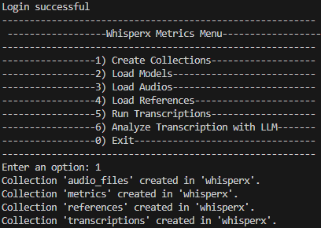
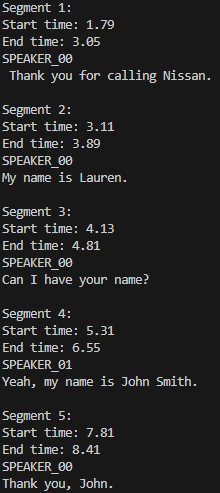
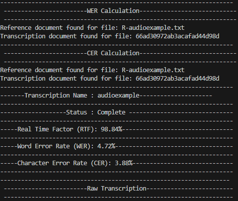
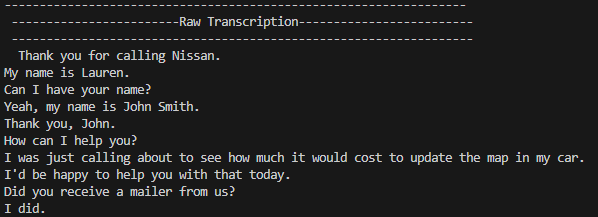

#### :white_check_mark: WhisperX Metrics

 Metrics project is designed to evaluate the performance of the speech to text process using a whisper faster model with [WhisperX](https://github.com/m-bain/whisperX) pipeline developed by [@m-bain](https://github.com/m-bain/) to generate the transcription and diarization of the audio conversation. The objective is to provide a framework for process the audio files as a batch load, generate the transcription, retrieve the diarization objects, and store them in a non-rel database, then evaluate the performance metrics of the transcription process within the loaded model. The module metrics can calculate the real time factor (RTF) for the audio file and if reference data is available the word error rate (WER) and character error rate (CER) can be calculated and stored into the database. The utils module allows to load whisper models that can be downloaded from huggingface, or manually copy into `models/` directory, and then transform it into whisper faster format. It can run transcriptions with mutiple models to the same audio and evaluate their individual performance based on the metrics. This speech to text process can be implemented into a ETL cycle for a large audio batch, generate new transcriptions, correct them and use as tagged audios for feed the training datasets for your models. 
 

#### :white_check_mark: Architecture 

#### :white_check_mark: Instructions

####  :arrow_right:  Previous settings

##### :small_blue_diamond: Set local environment

This version runs in a standalone windows local machine, but could run into a virtual environment. The needed dependencies are in requirements.txt, this specific code runs with whisperx 3.1.2, python 3.8. and CUDA 11.8. and the latest version of ffmpeg. 

`pip install -r requirements.txt`

#####  :small_blue_diamond: Set mongo db
 
Install mongodb and mongo compass, create the database `'whisperx'` then set the localhost uri, make sure to match with the one set in the connections of the project. 

##### :small_blue_diamond: Set huggingface credentials  

Set `hf_token` with your huggingface token, and `model_name` the huggingface uri the pretrained model, the current model set for download is whisper tiny english once selected both, run main.py

#### :arrow_right:  Menu

Once you have your local environment, the connection to mongodb, and the hf credentials run main.py and the menu will display 

##### :small_blue_diamond: 1) Create Database Collections 

When the database connection is ready, select option 1 to insert the collections schema into the database. 

##### :small_blue_diamond: 2) Load Models

 Select the option 2 in menu to download the whisper model, and then convert to whisper faster format. You can also load manually in models directory. 

##### :small_blue_diamond: 3) Load Audios 

Copy your audios in `local_input_batch/audio_batch/`, make sure to use mp3 format. Then select option 3 in menu, you should see the new audio files in the database, in the `audio_files` collection. 

 - Audio object example in mongo db 

##### :small_blue_diamond: 4) Load References 

This is an optional step, you have manually corrected transcriptions, for the audio, copy your referene files into `local_input_batch/reference_batch/`, make sure to name `R-<audioname>.txt`. Select the option 4 in menu, provide the `audio_id` generated in the database for the asociated mp3 file previously loaded, then you should see the reference in `references` collection.

 - Reference object example in mongo db

##### :small_blue_diamond: 5) Run Transcriptions

Once all setup, select option 5 in menu then run the transcription. If references are not available, word and character error rate won't be calculated. 

##### :large_blue_diamond: Transcription/Diarization Output 

##### :large_blue_diamond: Metrics Output

##### :large_blue_diamond: Raw Transcription

Raw Transcription shows the not aligned text output, if the model generate a consistent transcription, it can be used as a base to make a manual reference then calculate the WER and CER of the generated transcription asociated to a specific downloaded model, check an example on `local_input_batch/reference_batch/R-audioexample.txt`. 

####  :arrow_right: To DO List

- Intergate into a microservice, (fast_api, k8s, etc)

- Make a GUI

- Create a module to isolate the metrics functionalities